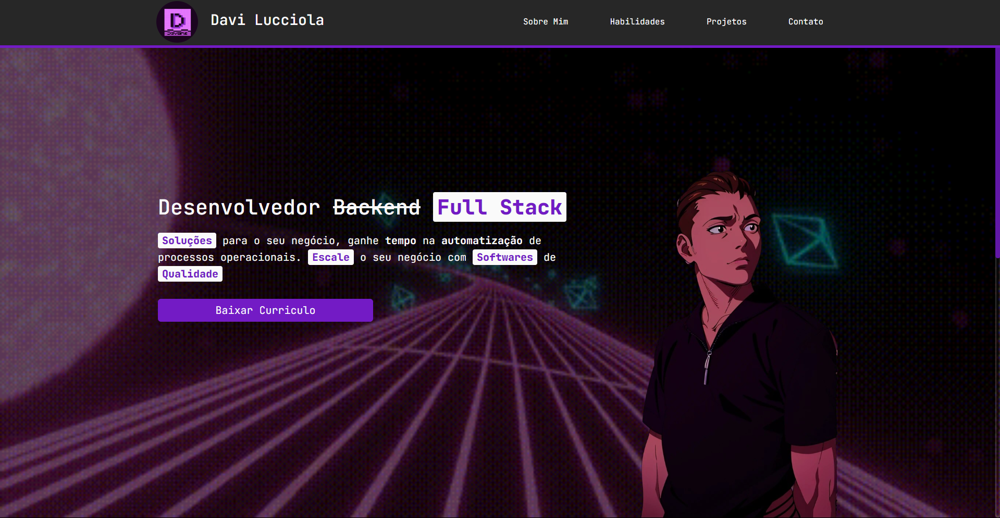

# Portifólio - Davi Lucciola

Apresentação profissional e pessoal, com portifólio para a demonstração dos projetos e do meu conhecimento em programação

## Tecnologias Utilizadas

- 
- 
- 

## Como rodar local

### Com Docker

1. Build a Imagem

   > `docker build . -t portifolio-app`

2. Rode a Imagem
   > `docker run -p 5000:5000 --name portifolio-app -d portifolio-app`

### Com o Poetry

1. Instale o [Poetry](https://python-poetry.org/)
2. Instale as depêndencias

   > `poetry install`

3. Ative o ambiente virtual

   > `poetry shell`

4. Rode com o Flask
   > `flask run --debug`
   > ou
   > `npm run dev`
