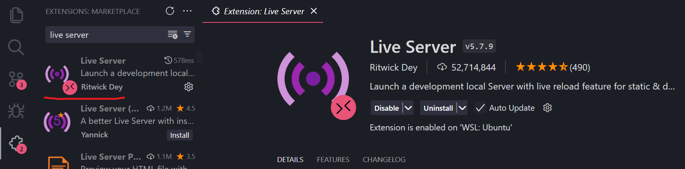
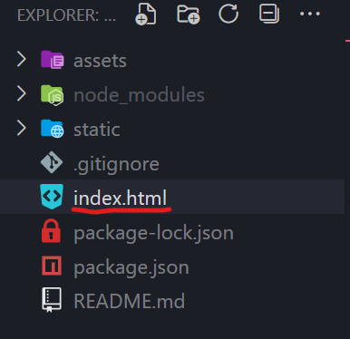
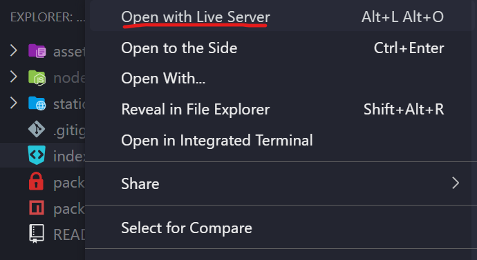

# Portifólio - Davi Lucciola

Apresentação profissional e pessoal, com portifólio para a demonstração dos projetos e do meu conhecimento em programação

## Tecnologias Utilizadas

- 
- 
- 

## Como rodar local

### Live Server

1. Clone o Repositório com `git clone https://github.com/davi-lucciola/portifolio.git`
2. Instale a extensão live server no VS Code

3. Clique com o botão direito no arquivo `index.html`

4. Clique em "Open with Live Server" ou "Abrir com o Live Server"

