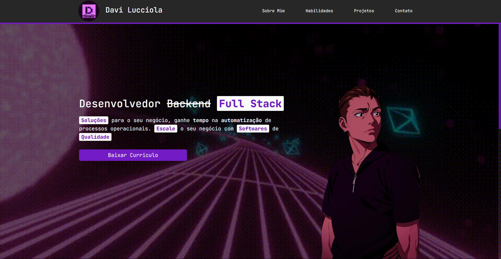
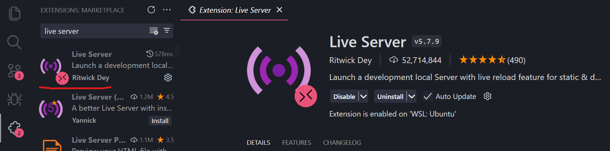
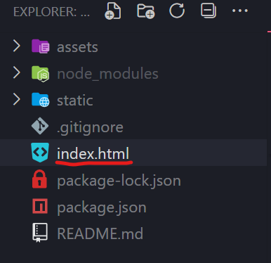
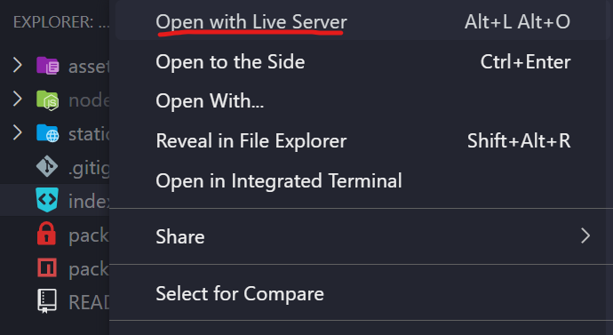

# Portifólio - Davi Lucciola

 Professional and personal presentetion, with a portifolio to demonstrate my knowledge in programming and web development

## Technologies

- 
- 
- 

## How to Run Local

### Live Server

1. Clone the repository with `git clone https://github.com/davi-lucciola/portifolio.git`
2. Install the `Live Server` in VS Code

3. Click with the right button in the file `index.html`

4. Click in "Open with Live Server"

And that is it! My portifolio is running!
